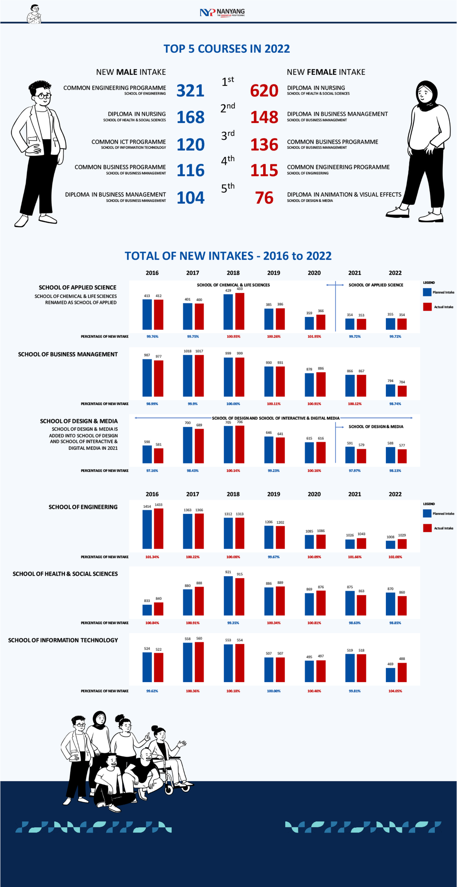
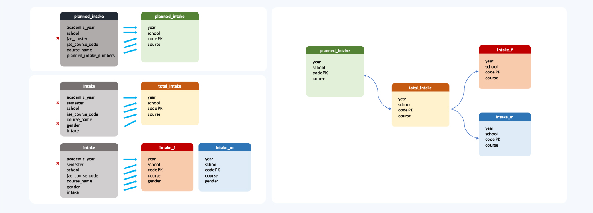
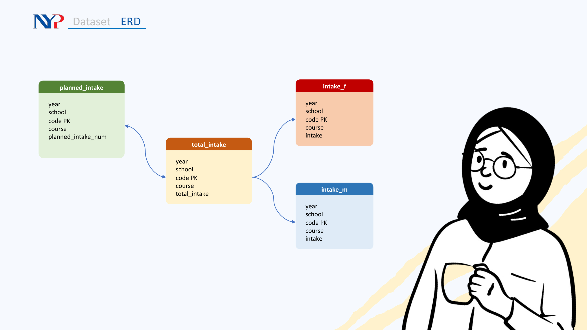
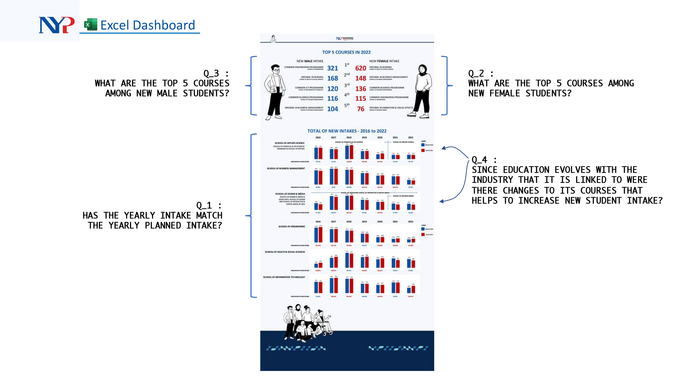

##### Capstone: PostgreSQL & Excel Dashboard
---
---
# NYP Student Intake: **PLANNED & INTAKE**

---
---
#### Dashboard

#### Dataset source:
**Source 01** \
Title: Nanyang Polytechnic Student Intake, Annual \
About this dataset: This dataset contains information on the student intake for Nanyang Polytechnic by semester. \
Coverage: January 1, 2013 to December 31, 2022 \
Last updated: December 27, 2022, 15:32 (SGT) \
Licence: Singapore Open Data Licence \
Format: CSV \
Column: 7 \
Rows: 909 \
Link: https://data.gov.sg/dataset/nanyang-polytechnic-student-intake-annual

**Source 02** \
Title: Nanyang Polytechnic Planned Intake, Annual \
About this dataset: This dataset contains information on Nanyang Polytechnic planned intake by year. \
Coverage: January 1, 2016 to December 31, 2022 \
Last updated: January 12, 2022 \
Licence: Singapore Open Data Licence \
Format: CSV \
Column: 6 \
Rows: 313 \
Link: https://data.gov.sg/dataset/nanyang-polytechnic-planned-intake-annual

#### Description of Capstone
According to the MINISTRY OF SOCIAL AND FAMILY DEVELOPMENT, the definition of Intake is that Intake refers to the new students entering the polytechnics in a particular year.

**planned_intake.csv**: CSV dataset shows data of NYP's intend for students intake across its six schools regardless of gender. Data is from 2013 - 2022

**intake.csv**: CSV dataset shows data of students intake into NYP across its six schools according to gender. Data is from 2016 - 2022.

I identified the following possible questions for this capstone:
- Q_1 : Has the yearly intake match the yearly planned intake?
- Q_2 : What are the top 5 courses among NEW FEMALE students?
- Q_3 : What are the top 5 courses among NEW MALE students?
- Q_4 : Since education evolves with the industry that it is linked to. Were there changes to its courses that helps to increase new student intake?

#### Phase 01: Entity Relationship Diagram - ERD
An entity relationship diagram gives a snapshot of how these entities relate to each other. You could call it the blueprint that underpins your business architecture, offering a visual representation of the relationships between different sets of data (entities).

The ERD screencapture below shows intended changes to be made using PostgreSQL.

#### Phase 02: PostgreSQL
Both CSV files were dumped as SQL files using SQLite3.

Process of normalisation and alteration are done using sql syntax as shown below.

#### Phase 03: Dashboard

---

#### Contact me
- LinkedIn: www.linkedin.com/in/muhammd-khairi-boyani-10694061
- Instagram: https://www.instagram.com/mikistudio21/

---
#### Platforms:
- Dashboards: Microsoft Excel
- SQL: PostgreSQL
- Markdown: dillinger.io

---
#### Illustration:
- www.openpeeps.com

---
